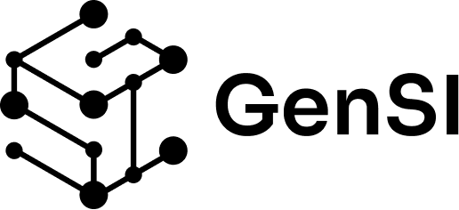
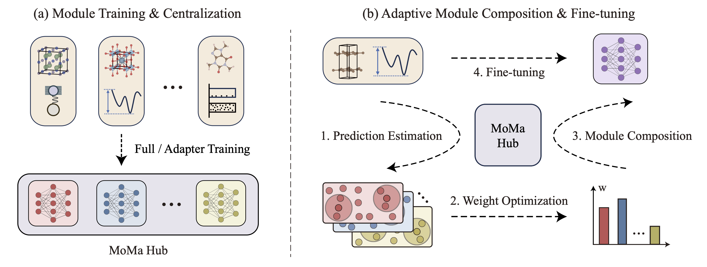
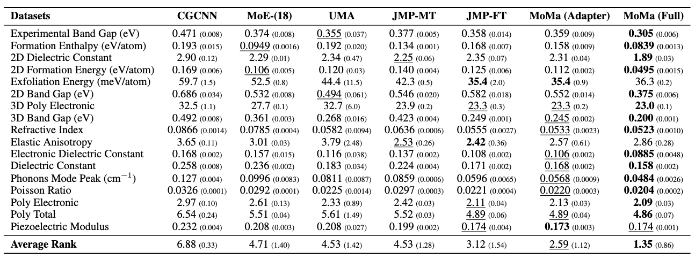

<div align="center">
  &nbsp;&nbsp;
  &nbsp;&nbsp;
  &nbsp;&nbsp;
  
</div>

---

<div align="center">

# MoMa: A Simple Modular Learning Framework for Material Property Prediction

[](https://arxiv.org/abs/2502.15483)
[](https://huggingface.co/GenSI/MoMa-modules-ICLR)
[](https://GenSI-THUAIR.github.io/MoMa/)

</div>

## 🔥 News
- **[2025/02]** We release our paper on arXiv! Check out [MoMa: A Simple Modular Learning Framework for Material Property Prediction](https://arxiv.org/abs/2502.15483).
- **[2025/05]** Our paper is presented as **spotlight** at AI4Mat-ICLR 2025!
- **[2026/01]** Our paper is accepted by ICLR 2026! See you in 🇧🇷 Rio de Janeiro!
- **[2026/03]** Code, datasets, and trained modules are now available!

## Introduction

Welcome to MoMa (**Mo**dular learning for **Ma**terials), a simple yet powerful paradigm for material property prediction. We note that material systems (e.g., crystals vs. molecules) and properties (e.g. energies v.s. band gap) suffer from **the diversity and disparity challenges**, so a monolithic model often **suffers from negative transfer and performs suboptimally**.

Instead of forcing all tasks into one shared model, MoMa **reframes learning as modular composition**. It adopts a two-stage pipeline: (1) **Module Training & Centralization**, which distills transferable knowledge from diverse high-resource tasks into a shared module hub, and (2) **Adaptive Module Composition and Downstream Fine-tuning**, where MoMa selects and weights modules based on their intrinsic alignment with the target task. The composed model is then fine-tuned for adaptation. Together, this design enables effective knowledge reuse while mitigating interference.



We evaluate MoMa on 17 material property prediction tasks **spanning electronic, thermal, mechanical, and phonon-related properties**. MoMa achieves consistent and substantial improvements, outperforming baselines with an average improvement of **14%**. 



Beyond performance, our analysis reveals three key findings:
1.	**The scaling law of modules**: MoMa improves monotonically as more modules are added to the hub, showing strong scaling behavior.
2.	**Superior few-shot performance**: MoMa’s advantage becomes even more pronounced in few-shot settings, highlighting its data efficiency under realistic label scarcity.
3.	**Interpretable Material Insights**: the learned composition weights reveal meaningful relationships between material properties.

Finally, we have officially released the 18-module MoMa Hub on [Hugging Face](https://huggingface.co/GenSI/MoMa-modules-ICLR) and will continue expanding it with more modules and broader material domains.

## Getting Started

### Installation

For GPU machines, follow the commands below to install the python environment:

```bash
conda env create -f environment.yml
pip install torch-cluster torch-scatter torch-sparse -f https://data.pyg.org/whl/torch-2.0.0+cu117.html
conda activate moma
pip install -e .
```

### Datasets

The benchmarking dataset for pre-training and fine-tuning are adopted from [this repo](https://github.com/rees-c/MoE).

For convenience, we have provided the preprocessed dataset for pre-training and fine-tuning at the module_lmdbs and few_shot_lmdbs folders of [this link](https://drive.google.com/drive/folders/1jJK-EufYcGJ8qGLg12aqdTYy1DuNTu7D?usp=drive_link).

### Pretrained MoMa Hub Modules

We release 18 pretrained MoMa Hub modules on [Hugging Face](https://huggingface.co/GenSI/MoMa-modules-ICLR). Download them into the `hub/` directory before running downstream fine-tuning.

```bash
pip install huggingface_hub
hf download GenSI/MoMa-modules-ICLR --repo-type model --local-dir ./hub
```

After downloading, verify that the `hub/` directory contains 18 `.pt` files:

```
hub/
├── castelli_eform.pt
├── jarvis_bandgap.pt
├── jarvis_dielectric_opt.pt
├── jarvis_eform.pt
├── jarvis_gvrh.pt
├── jarvis_kvrh.pt
├── mp_bandgap.pt
├── mp_eform.pt
├── mp_gvrh.pt
├── mp_kvrh.pt
├── n_avg_eff_mass.pt
├── n_e_cond.pt
├── n_Seebeck.pt
├── n_th_cond.pt
├── p_avg_eff_mass.pt
├── p_e_cond.pt
├── p_Seebeck.pt
└── p_th_cond.pt
```

### Running MoMa

To reproduce the main results of MoMa, you need to first download the pretrained [JMP-L](https://github.com/facebookresearch/JMP) checkpoint and place it in the project root as `jmp-l.pt`:

```bash
wget -O jmp-l.pt https://jmp-iclr-datasets.s3.amazonaws.com/jmp-l.pt
```

#### Module Training

First we run the module training process that constructs MoMa hub:

```shell
bash scripts/pretrain_modules.sh
```

#### Adaptive Module Assembly

Run the adaptive selection of upstream modules for each downstream task:

```bash
bash scripts/extract_embeddings.sh
python scripts/run_knn.py
python scripts/weight_optimize.py
```

The selection result will be automatically saved into the `json/` directory. (Note that we already saved a copy of our replicated weight selection results in `json/` for fast reproduction.)

#### Downstream Fine-tuning

Finally, fine-tune on the downstream tasks to evaluate the effectiveness of MoMa:

```bash
bash scripts/finetune_moma.sh
```

To test the baseline results of **not using** MoMa Hub modules, run:

```bash
bash scripts/finetune_baseline.sh
```

## License \& Acknowledgments

This work is licensed under the [Attribution-NonCommercial 4.0 International (CC BY-NC 4.0)](https://creativecommons.org/licenses/by-nc/4.0/) license. You are free to share and adapt the material for **non-commercial purposes**, with appropriate credit given. Portions of the codebase are adapted from the [Open Catalyst Project](https://github.com/Open-Catalyst-Project/ocp) (MIT Licensed) and [JMP](https://github.com/facebookresearch/JMP) (CC-BY-NC licensed).

## Citation

If you refer to MoMa in your research, please cite our paper:

```bibtex
@article{wang2025moma,
  title={MoMa: A Modular Deep Learning Framework for Material Property Prediction},
  author={Wang, Botian and Ouyang, Yawen and Li, Yaohui and Wang, Yiqun and Cui, Haorui and Zhang, Jianbing and Wang, Xiaonan and Ma, Wei-Ying and Zhou, Hao},
  journal={arXiv preprint arXiv:2502.15483},
  year={2025}
}
```